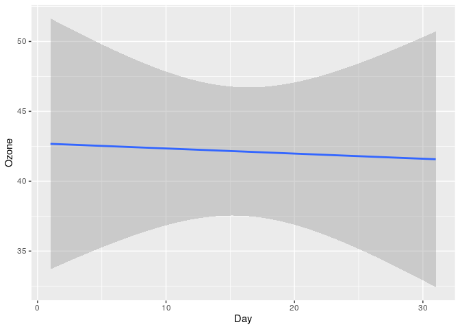

A linear model suggests ozone levels are stable
================

> The bulk of the computation should have already happened upstream, and
> the most of the code chunks in the report itself should be terse calls
> to tar\_read() and tar\_load().

–<https://books.ropensci.org/targets/files.html#literate-programming>

### Setup

``` r
library(targets)
library(ggplot2)
```

### Introduction

This report summarizes our results, mostly as terse calls to
`tar_read()`. For implementation details, see the underlying targets
pipeline:

``` r
writeLines(readLines("_targets.R"))
#> library(targets)
#> 
#> options(TZ="Germany/Berlin")
#> tar_option_set(imports = "ds.targets", packages = c("ds.targets", "tidyverse"))
#> 
#> list(
#>   tar_target(path, raw_path(), format = "file"),
#>   tar_target(raw, command = read(path)),
#>   tar_target(data, clean(raw)),
#>   tar_target(model, linear_model(data))
#> 
#> )
```

### Methods

To make this project easy to reproduce and share we built the R package
[ds.targets](https://github.com/2DegreesInvesting/ds-targets). You can
install it from GitHub with:

``` r
# install.packages("devtools")
devtools::install_github("2DegreesInvesting/ds.targets")
```

To clean the raw data we removed observations where `Ozone` values were
missing.

``` r
# Source code
ds.targets::clean
#> function(raw) {
#>   dplyr::mutate(
#>     raw,
#>     Ozone = tidyr::replace_na(.data$Ozone, mean(.data$Ozone, na.rm = TRUE))
#>   )
#> }
#> <bytecode: 0x511a550>
#> <environment: namespace:ds.targets>

# Before
raw_data <- tar_read(raw)
any(is.na(raw_data$Ozone))
#> [1] TRUE

# After
clean_data <- tar_read(data)
any(is.na(clean_data$Ozone))
#> [1] FALSE
```

To explored changes in `Ozone` through time we use a linear model.

### Results

Here are our results:

``` r
ggplot(clean_data, aes(Day, Ozone)) + geom_smooth(method = "lm")
#> `geom_smooth()` using formula 'y ~ x'
```

<!-- -->

### Conclusion

We see no evidence that Ozone changes through time.
